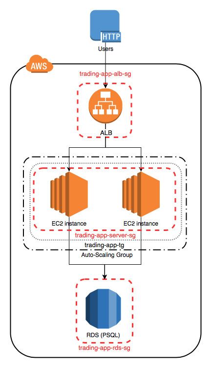
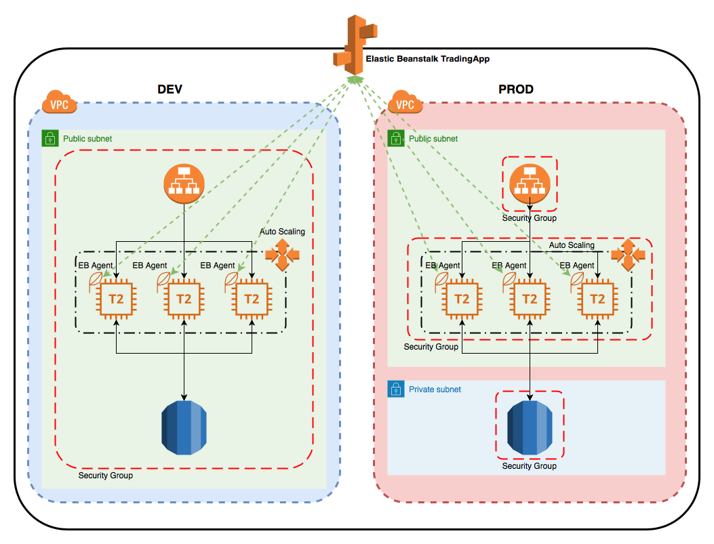
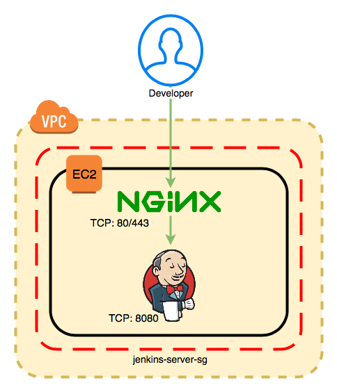
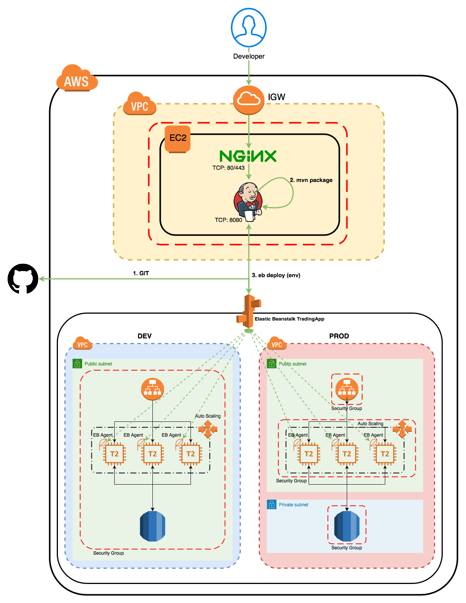

# Cloud & DevOps Project

# Introduction
The project focuses on the development and deployment of an online stock trading application using REST API. It can manage quotes, create or delete traders, manage traders accounts, execute market orders and also provide portfolios and trader profiles. Front-end developer, mobile developer, and traders can utilize this REST API. The trading application has a MicroService and three-tier architecture implemented with SpringBoot. PSQL database is used for storing data and therefore helps in isolating application and its data. The project utilizes, IEX Cloud, as the data source for accessing quotes information, and AWS cloud services, for application deployment for scalability, elasticity, and high availability. Also, a CI/CD pipeline using Jenkins is implemented to automate and fasten the deployment lifecycle.

# Application Cloud Architecture
 
- EC2 - EC2 instances are virtual machines that you launch in the AWS Cloud. The ability to resize instances, combined with services that let you create and destroy instances according to the demands, give truly elastic capacity, hence the name Elastic Compute Cloud.
- security groups - AWS security groups are reusable groups of network security rules. They define incoming and outgoing rules, and they can be attached to almost any resource in AWS: EC2 instances, elastic load balancers, RDS databases, and more. They act like local firewalls for that resource. 
- ALB - An Application load balancer evenly distributes traffic between EC2 instances that are associated with it. Clients send a request to ALB URL, which will forward the request to each application server using round-robin scheduling.
- target group - A target group is a group of instances that are associated with a given ALB.
- auto-scaling - Auto Scaling automates the process of adding (scaling-up) or removing (scaling down) of EC2 instances based on traffic demand for your application.
- The trading application utilizes the AWS Cloud services such as Application Load Balancer (ALB) and Auto Scaling Group (ASG) for supporting scalability and elasticity. ALB receives client requests and distributes evenly to EC2 instances belonging to the targeted group associated with ALB using round-robin scheduling. ALB checks for unhealthy instances and directs requests to healthy instances. In case of application server crashes, AWS EC2 service will try to restart the instance. However, manual intervention is required when the application server is having issues. To solve this problem, AWS offers AWS Auto-Scaling service, which can kill and launch instances (using existing AMI) based on health status. AWS Auto-Scaling service provides the ability to automatically increase/decrease the number of EC2 instances from a target group based on some metrics, such as the number of incoming requests (to ALB), CPU load, memory usage, disk I/O, etc.
  
# Deployment Environments
Elastic Beanstalk (EB) is used to provision AWS infrastructures and deploy the application. EB requires a single zip file that contains jar files, and it is automated using maven. Then EB requires an application (`trading-app`) that holds the source code (zip file created by maven `trading-1.0-SNAPSHOT-elastic-beanstalk.zip` and details regarding the platform to be used (`java 8`). DEV and PROD environments are created using this application. An environment describes the platform and software used, EC2 instances, security groups, associated target groups, RDS, networks, Application Load Balancer and Auto - Scaling Group. An EB will provision all AWS infrastructures described in an environment and deploy your application. EB installs an agent on each instance (it's part of the EB AMI). When a new version is uploaded, EB will transfer the new version to each instance which EB agent will re-launch the application.

The purpose of these environments is to maintain and separate developers and end-users.  It is common that developers share the same development environment, make changes/updates/modifications to the source code (DEV environment - `TradingApp-env`) and deploy GIT feature and development branches. This environment is not available to external teams or clients. On the other hand, the production environment (PROD environment - `TradingApp-prod`) are consumed by clients and deploy the GIT master branch. 
 
- EB - Elastic Beanstalk that provisions AWS infrastructures and deploys your application.
- DEV and PROD env - In software deployment, an environment or tier is a computer system in which a computer program or software component is deployed and executed. Dev env is the EC2 and RDS instances used for developing purpose. PROD is the EC2 and RDS instances consumed by clients.
	
# Jenkins Server
 
- Jenkins - Jenkins is an open-source continuous integration/continuous delivery and deployment (CI/CD) automation software DevOps tool written in the Java programming language. It is used to implement CI/CD workflows, called pipelines.
- NGINX server proxy - NGINX is open-source software for web serving, reverse proxying, caching, load balancing, media streaming, and more. NGINX can function as a reverse proxy and load balancer for HTTP, TCP, and UDP servers. A reverse proxy accepts a request from a client, forwards it to a server that can fulfil it, and returns the server's response to the client.
	
# Jenkins CI/CD pipeline
 
Jenkins' CI/CD pipelines can execute deployment commands automatically on a Jenkins Server (in this project, provisioned an Ubuntu EC2 instance). `JenkinsFile` defines the pipeline steps, which is usually stored in the source code root directory. The pipeline will execute the following steps specified in the JenkinsFile.
1. Download source code from a given GIT repo.
2. `mvn clean package` trading-app source code which generates a zip file for EB deployment.
3. Deploy the zip file into the corresponding EB environment (e.g. develop branch will be deployed into DEV env) using `eb` command.

# Improvements
1. Setting up Identity Access and Management (IAM) for different users (developers), roles, groups and policies.
2. ALB security policy can be varied to the CPU performance of the instances instead of target tracking policy.
3. Exploration of AWS services for monitoring, alerts and notifications could be done.