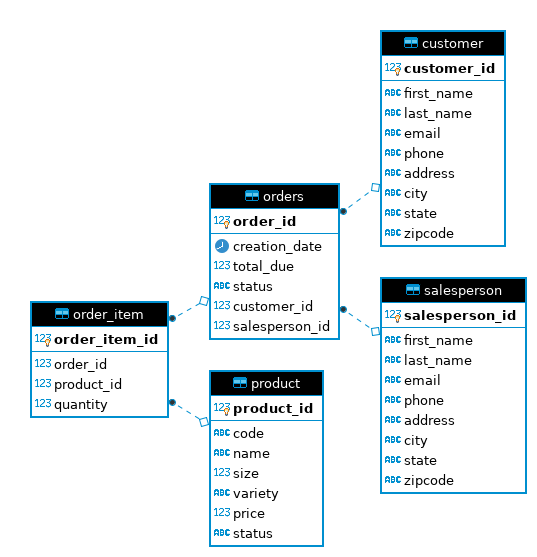

# Introduction
The project has implemented a JDBC app in Java. JDBC allows a connection between a Java application and an RDBMS. In this project,`DatabaseConnectionManager` class establishes a connection to PostgreSQL by passing values for `hostname`, `database`, `username` and `password`. A `findById` method implemented under `Orderdao` class takes `orderId`, and executes SQL statement `GET_BY_ID` which joins tables `customer`, `salesperson`, `order_item` and `product` and returns data based on passed `orderId`. The method returns an `Order` type object with multiple order items under the passed `orderId` as a list. In this project, DAO and Repository design patterns, as well as some advanced JDBC concepts, was learned.

# ER Diagram

# Design Patterns
Data Access Object (DAO) pattern provides an abstraction between JDBC and the rest of the code. DAO is a class or interfaces that CRUD an object in a project. In general, an object could be a single row in the database table (e.g., a Customer) or can also represent a result of a more complex query (e.g., Customer table join Order table). DAO pattern supports accessing data from multiple tables and provides encapsulation of complex join joins and aggregations. On the other hand, the Repository pattern focuses on a single table per class. We can perform basic CRUD (Create, Read, Update and Delete) operations on it. In a repository pattern, instead of joining tables in the database, it is done in code. For example, in repository pattern, we select data from Orders, get the customer id, and then go to Customer repository and find a customer with that id, and then join it in the code. However, in case of DAO pattern, we get the Order table, then the Customer table and join it in the database to the order using the foreign key relationship.