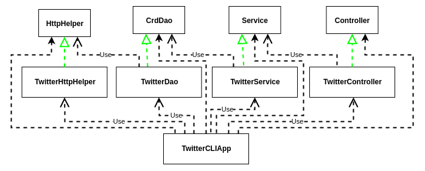

# Introduction
In this project, java app is implemented, which can post, show and delete twitter post through Twitter REST API. Twitter app is build that can create, read and delete tweets from Command Line Interface(CLI). From this project, learned basics of REST API, Twitter API and Java 8. Also, explored libraries such as HTTP Client, JSON serialization/deserialization, testing using JUnit and Mockito. Used designs patterns like DAO (Data Access Object), DTO (Data Transfer Object) and CRUD operations. Learned regarding class dependencies relationship and how it could be used to manage with Spring Inversion of Control (IoC container) and Beans.

# Quick Start
- `mvn package` - The package goal will compile your Java code, run any tests, and finish by packaging the code up in a JAR file within the target directory. The name of the JAR file will be based on the project's `<artifactId>` and `<version>`.
- Twitter App Usage - `Usage: TwitterCLI post|show|delete [options]`
    * Create/post - Create a tweet with a geotag and output the created tweet object (simplified version) in JSON  format. Print error message (or exception) if tweet_text length is over 140 characters or geo tag is invalid (latitude or longitude is out of range).
  ```
  USAGE:
    TwitterCLI "post" "tweet_text" "latitude:longitude"
    
    Arguments:
    tweet_text         - tweet_text cannot exceed 140 UTF-8 encoded characters. 
    latitude:longitude - Geo location.
    
    e.g.
    TwitterCLI "post" "test post" "0:0"
  ```
  
  * Read/show - Lookup a tweet by ID and print the tweet object in JSON format. Print error message (or exception) if tweet_id is invalid (e.g. non-digit characters, out of range) or optional [field1,filed2] is invalid.
  ```
  USAGE:
  TwitterCLI show tweet_id [field1,fields2]
  
  Arguments:
  tweet_id  - Tweet ID. Same as id_str in the tweet object
  [field1,fields2]  - A comma-separated list of top-level fields from the tweet object (similar to SELECT clause in SQL)
  
  e.g. 
  TwitterCLI show 1097607853932564480 "id,text,retweet_count"
  ```
  * Delete - Delete a list of tweets by id and output deleted tweet id and print deleted tweet object.
  ```
  USAGE: TwitterCLI delete [id1,id2,..]
  
  Arguments:
  tweet_ids - A comma-separated list of tweets.
  
  e.g.
  TwitterCLI delete 1200145224103841792
  ```

# Design
- UML Class diagram



The components of this app are `TwitterCLIApp` or `main`, `TwitterController`, `TwitterService` and `TwitterDao`
- DAO - The data access layer handles models (implemented with POJOs). In this app, the DAO layer post/show/delete tweet(s). In this app, `CrdDao` and `TwitterDao` only handle data with external storage, in this project REST API. `HttpHelper` and `TwitterHttpHelper` is solely responsible for executing HTTP with a given URI. Also, it authorizes the HTTP request using Twitter secrets.
- Service - The service layer `Service` and `TwitterService` handles business logic and calls the DAO layer 'CrdDao` and `TwitterDao` to interact with the underlying storage/service, which is the Twitter REST API in this app.  In this app, the business logic implemented, checks if the tweet text exceeds 140 characters and if longitude/latitude coordinates passed is out of range.
- Controller - The controller layer interacts and parsers user input (CLI args in this APP). It also calls the service layer and returns results. The Controller layer classes, `Controller` `TwitterController` consumes user input (args in this app) and calls the corresponding service layer method (`postTweet()`, `showTweet()` or `deleteTweet()`). It does not handle any business logic.
- App/main - The `TwitterCLIApp` or `main` is responsible for declaration and instantiation of all dependent components and call the `run()` method, which in turn takes the user arguments, calls the controller methods and prints the tweets.

# Spring
In the `TwitterCLIApp`, we used the `main` method to create all components and set up the dependency relationship manually. It becomes more complicated when you need to manage dozens of components, and each one requires more than one dependencies. The Spring framework solves the Dependency management(DM) problem. Spring framework manages all dependencies. The developer is responsible for defining the dependency relationship, and the IoC container will automatically create all components/dependencies in the correct order. Then you can execute the `run()` method, which runs the app according to user inputs.

In the Spring framework, there are two most fundamental components, IoC container, and Beans.
Beans - If a component/class/object is created/managed by an IoC container, it's a bean in the Spring world. In this project, `TwitterCLIApp`, `TwitterController`, `TwitterService`, `TwitterDao`, and `TwitterHttpHelper` are Beans since they care created by the `main` method.
IoC Container - Spring Framework implementation of the Inversion of Control (IoC) principle, also known as dependency injection (DI). It is a process whereby objects define their dependencies only through constructor arguments. The IoC container then injects those dependencies when it creates the bean. This process is fundamentally the inverse of the bean itself, controlling the instantiation or location of its dependencies.

@Bean approach (`TwitterCLIBean`) - Here we define dependency relationship using @Bean and pass dependencies through method arguments and then create an IoC container/context which will automatically instantiate all Beans base on the relationship specified. Finally, we get the main entry point (`TwitterCLIApp`) from the IoC container and start the program. 

@ComponentScan approach (`TwitterCLIComponentScan`) - Although the @Bean approach replaced the traditional `main` method dependency management, it still requires a lot of manual work which requires developers to specify Beans and dependencies one by one. The alternative approach would be to take advantage of the implementation of interface, where dependencies are pass through constructors, which implies dependencies relationship and eliminate all manual work.
For instance, `TwitterController` depends on `Service`. We can use `@Autowired` annotation to tell IoC container to inject dependency through the constructor. Finally, you need a Spring configuration file to describe the IoC container where to look for Beans (@Components). 

# Models
Models are implemented with POJOs(`Entities`,`Coordinates`, `Hashtag`,`UserMention`), which is a class with private member variables and public getter and setters. This class encapsulates Tweet data (Tweet Objects) which often display in JSON format. In this application, we use the same `Tweet` model, which describes the simplified tweet object as a Data Transfer Model (or DTO) and Data access model (or domain model). Tweet Objects have the following Tweet data created_at, id, id_str,  text, entities (hashtags, user_mentions), coordinates, retweeted_count, favorited_count, favorited, and retweeted.

# Improvements
1) The operations carried out through this app is post, show and delete tweets. There is no implementation for modifying or updating the tweet. Implementation of the `updateTweet` method could be done to complete CRUD operations.
2) Through this app, `showTweet` method is used to read tweets through `TweetID`. It may not always be possible to know the id of the tweet unless it is tracked and stored. More options for retrieving data could be implemented, i.e. through screen_name or user_name etc.
3) Usage of the posting a tweet demand three arguments, including text and longitude and latitude data inputs from the user. If not provided, the app fails to execute. Either there could be more flexible options available or a way to take longitude and latitude data automatically instead of user feeding them as arguments.