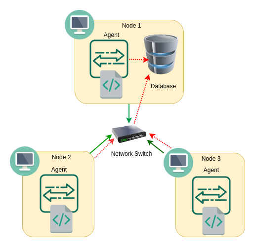

# Linux Cluster Monitoring Agent

## Introduction
Cluster Monitor Agent is an internal tool that allows users to monitors nodes connected in a Linux cluster by tracking and recording resources usage (CPU and Memory usages) in realtime to an RDBMS Database. Using Docker, a container for psql instance is created, which contains the database that holds the recorded data. In every 1 minute interval, the resource usage information is fed to the database. It helps the infrastructure team to generate some reports for future resource planning purposes such as addition or removal of servers to support their business. For instance, if the usage of the server has a higher percentage, then more node/server/host would be required to distribute the load efficiently.

## Architecture and Design
   
   
As described in the architecture diagram above, all the nodes/servers/hosts are connected through a network switch. Bash script (Monitoring agent) is running on each node in the Linux Cluster. These scripts will execute individually on the nodes, and acquire its resource usage data which will be directed and stored to the database set up on node 1. 
### Database and Tables
The database, `host_agent` has two tables `host_info` and `host_usage`. The former collects Hardware Specification information of each node and executes once after installation. Whereas the latter stores CPU and Memory usage information at every 1 minute. Following are the hardware specification data in `host_info` table:
 * id - Unique identification number, is a primary key in the table and auto-incremented by PostgresSQL
 * hostname - Hostname of the server, have unique constraint and value is acquired using`$(hostname -f)`
 * cpu_number - Indicates the number of CPUs in the server. Collected data from `lscpu`
 * cpu_architecture - information regarding the architecture of the server. Acquired data from `lscpu`
 * cpu_model - Model of the CPU of the server. Data acquired from `lscpu`
 * cpu_mhz - Operating frequency of the CPU of the server. Obtained information from `lscpu`
 * L2cache - Information regarding L2 Cache memory of the server. Collected data from `lscpu`
 * total_mem - Total memory information of the server. Information is collected from `/proc/meminfo`
 * timestamp - Date and time. Acquired information from `(date "+%F %T")`

Following are Linux Resource Usgae Data in `host_usage` table and is tracked every 1 minute:
 * timestamp - Date and time. Information collected from `(date "+%F %T")`
 * host_id - Unique identification number, is a foreign key in the table and referenced to `host_info` table by `id` field
 * memory_free - Available free memory on the server. Information acquired from `/proc/meminfo`
 * cpu_idle - CPU idle is the percentage of CPU time when it is idle. Information collected from `$(vmstat -t)`
 * cpu_kernel - Information regarding percentage of CPU time in executing kernel process. Information collected from `$(vmstat -t)`
 * disk_io - Information regarding input/output in process. Information obtained from `$(vmstat -d)`
 * disk_available - Availability of disk space in server. Information collected from `$(df -BM /)`

### Script Descriptions
  * `host_info.sh` - The script collects hardware configuration information and then insert the data to the psql instance. You can assume that hardware specifications are static so that the script is only required to execute once. 
  * `host_usgae.sh` - The script collects server usage data and then stores the data into the psql database. The script is executed in every minute using Linux `crontab`. 
  * `psql_docker.sh` - The script runs Docker if not running and create, start or stop a container `jrvs-psql` based on provided username and password.
  * `ddl.sql` - This script, switches to database `host_agent`, defines `host_info` and `host_usage` tables and contains some sample values for verification of the constraints of the table.
  * `queries.sql` - This script contains the following two SQL queries that help the users to manage cluster better and also plan for future resources.
  
       i) Providing information regarding total memory per host based on the number of CPU in descending order.
       
       ii) Calculating the average used memory percentage over 5 minutes interval for each host/server.

## Usage
1) Database and Table initialization

   Before starting with monitoring agent bash script, it is needed to setup a psql instance `jrvs-psql` using docker. Then create `host_agent` database followed by creating `host_info` and `host_usage` tables.
   ```
   # Create a psql docker container with the given username and password.
   ./linux_sql/scripts/psql_docker.sh create db_username db_password
   
   #Initializing database and tables
   psql -h psql_host -U psql_user -W -d psql_database -f linux_sql/sql/ddl.sql
   ```
2) *host_info.sh* Usage

   Now to collect hardware information data from the host/node/server and store it on table `host_info` present inside the database `host_agent` which is in turn present inside the psql container `jrvs-psql` and  run the following command: 
   ```
   bash ./linux_sql/scripts/host_info.sh psql_host psql_port db_name psql_user psql_password
   ```
3) *host_usage.sh* Usage

   In order to collect server usgae information and store on `host_usage` table execute the following command:
   ```
   bash scripts/host_usage.sh psql_host psql_port db_name psql_user psql_password
   ```  
4) crontab Setup

   A crontab job can be created to repeatedly run *host_usage.sh* script after a specified interval. It can be done as follows:
   ```
   #edit crontab jobs
   crontab -e
   
   #add this to crontab to trigger host_usage.sh every 1 minute
   * * * * * bash [path]/host_usage.sh  psql_host psql_port db_name psql_user psql_password > /tmp/host_usage.log
   
   #list crontab jobs
   crontab -l
   
   #Verify that the script is running as intended by checking the log file
   cat /tmp/host_usage.log
   ```
## Improvements 
1) It is the consideration that hardware specification stays constant for this project. However, in case it is not fixed, implementation is required to check and store/update the hardware specification of the server. Probably should be able to provide information regarding what specification changed and when on the server.
2) In case a server/host/node failed to store the usage information in the database. There should be some failure indication implemented.
3) To combine and automate everything under usage section to make it easy and user friendly.
4) It would always be better to have a backup of the database. In case if the node holding a database is having technical issues, there should be a possibility to redirect the updates to the backup database.