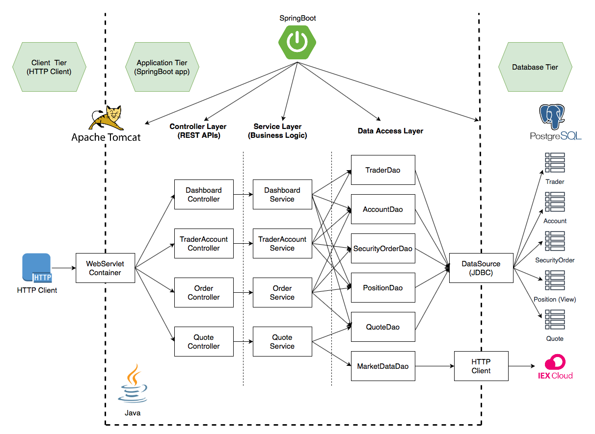

Table of contents
* [Introduction](#Introduction)
* [Quick Start](#Quick-Start)
* [Architecture](#Architecture)
* [REST API Usage](#REST-API-Usage)
* [Docker Deployment](#Docker-Deployment)
* [Improvements](#Improvements) 

# Introduction
The Springboot Project is an online stock trading application using REST API. It can manage quotes,  create or delete traders, manage traders accounts, execute market orders and also provide portfolios and trader profiles. Front-end developer, mobile developer, and traders can utilize this REST API.
It is a MicroService which is implemented with SpringBoot. PSQL database is used for storing data and therefore helps in isolating application and its data. IEX Cloud is used as the data source since the project focuses primarily on features such as functionalities, and feasibilities.

# Quick Start
- Prequiresites: Docker, CentOS 7
- Docker scripts
  - `docker build` is used to bulid image using Dockerfile which allows you to set properties and entry point. Here,`trading-psql` and `trading-app` docker image build using Dockerfile which consists of official docker image to be used and entry points. 
    ```
    cd ./springboot/psql
      docker build -t trading-psql .  #docker builds ./Dockerfile by default
      docker image ls -f reference=trading-pqs
      
      cd ./springboot/
          docker build -t trading-app . #docker builds ./Dockerfile by default
          docker image ls -f reference=trading-app
    ```
  - `docker network create` is used create docker network. `trading-net` is a docker network which allows docker containers to communicate with each other. In this case, `trading-app` need to communicate with `trading-psql` which listens on port 5432.
     ```
       #create a new docker network
       sudo docker network create teading-net
  
       #verify
       docker network ls
    ```
  - `docker run` is used to create containers using images. Both `trading-psql-dev` and `trading-app-dev` containers are attached to same `trading-net` network.
  
    ```
      docker run --name trading-psql-dev \
      -e POSTGRES_PASSWORD=password \
      -e POSTGRES_USER=postgres \
      --network trading-net \
      -d -p 5432:5432 trading-psql
      
      #set IEX credential
      IEX_PUB_TOKEN="your_token"
      #start trading-app container which is attached to the trading-net docker network
      docker run --name trading-app-dev \
      -e "PSQL_URL=jdbc:postgresql://trading-psql-dev:5432/jrvstrading" \
      -e "PSQL_USER=postgres" \
      -e "PSQL_PASSWORD=password" \
      -e "IEX_PUB_TOKEN=${IEX_PUB_TOKEN}" \
      --network trading-net \
      -p 8080:8080 -t trading-app
      
      #list running containers
      docker container ls
      
      #verify
      docker ps
  
    ```
- `trading-app` with SwaggerUI

  

# Architecture
  
  
 
- It is a Three-Tier Architecture:
  * Client tier: users can use HTTP clients to consume the REST (e.g. chrome, postman, curl, java, javascript, etc.). In this project, we are using SwaggerUI or postman.
  * Application tier: a Springboot java program which only processes data.
  * Database Tier: application data are stored in a database instance. If the Java application is interrupted or fails, the application does not lose any history data.
- Controller layer - It handles HTTP requests. Each controller calls the particular service method and returns results. There many controllers in this architecture: `QuoteController`,`TraderAccountController`, `OrderController` and `DashboardController`.
- Service layer - It handles business logic and calls the respective DAO layer to interact with the underlying storage/service which database and IEX cloud. It checks if there is a sufficient amount to buy stocks and checks if required positions are available for the given ticker to sell stocks. Service layers consist of `OrderService`, `QuoteService`,` TraderAccountService` and `DashboardService`.
- DAO layer -  Data access layer persist and retrieve data from external database sources. In this project, we are using JDBC and PostgreSQL to store and retrieve data into a database `jrvstrading`. Also, quotes are updated from IEX cloud using HTTP Client, which is returned in JSON format. Data access layer consists of `TraderDao`, `QuoteDao`,`AccountDao`,`PositionDao`, `SecurityOrderDao`, and `MasrketDataDao`.
- SpringBoot: webservlet/TomCat and IoC - webservlet provides a "pure Java" HTTP web server environment for Java code to run in. Every single HTTP request from a browser to Tomcat is processed in the Tomcat process in a separate thread. The Spring container is responsible for instantiating, configuring and assembling objects known as beans, as well as managing their lifecycle. Dependency Injection in Spring can be done through constructors, setters or fields.
- PSQL and IEX - `https://iexcloud.io/` is a REST API that provides market data (e.g. stock quote). Although IEX data is not real-time, it's a good source to obtain data for this MVP. PostgreSQL database is used to host application data (the Java application does not store any data). If the Java application fails or crashes, the entire application does not lose any history data.

# REST API Usage
## Swagger
Swagger is a powerful yet easy-to-use suite of API developer tools for teams and individuals, enabling development across the entire API lifecycle, from design and documentation, to test and deployment. Swagger consists of a mix of open-source, free and commercially available tools that allow anyone, from technical engineers to street smart product managers to build amazing APIs that everyone loves.
Swagger UI allows anyone be it your development team or your end consumers to visualize and interact with the API's resources without having any of the implementation logic in place. It's automatically generated from your OpenAPI (formerly known as Swagger) Specification, with the visual documentation making it easy for back end implementation and client-side consumption.

## Quote Controller
- Manages CRUD operations on the quotes. The market data is acquired from the IEX cloud as JSON, and then it is mapped to `IexQuote` object which is then used to retrieve `quote` field data to be stored in `quote` table present in PSQL database.
  - GET `/quote/dailyList`: Show all tickers that are available to be traded on this trading platform.
  - GET `/quote/iex/ticker/{ticker}`: Presents IexQuote for the given valid ticker.
  - POST `/quote/tickerId/{tickerId}`: Adds a new ticker to the trading platform.
  - PUT `/quote/`: Update a given quote in the quote table. This endpoint is for debugging and testing purpose, which allows you to manipulate a quote from the quote table manually.
  - PUT `/quote/iexMarketData`: Fetches quotes from IEX and update all quotes from the quote table.
  
## Trader Controller
- It manages trader and account information. It can deposit and withdraw fund from a given account.
  - POST `/trader/*`: There are two endpoints that can create a new trader. The first will allows you to create a new trader using an HTTP request body, and the other one will enable you to use a URL. 
  - PUT `/trader/deposit/*`: deposits fund to the given traderId. 
  - PUT `/trader/withdraw/*`: withdraws fund from the given traderId.
  - DELETE `/trader/traderId/{traderId}`: it deletes a trader by providing traderId. Before deleting the trader, all positions are closed, and all funds are withdrawn.
  
## Order Controller
- It manages the execution of market order which deals with buying and selling shares.
  - POST `order/marketOrder`: Basically, purchase or sell shares by providing with ticker, accountId and size to place security order.

## Optional(Dashboard controller)
- Provides portfolio of the trader and trader profile information.
  - GET `/dashboard/portfolio/traderId/{traderId}`: Show portfolio by trader which includes security orders under the trader account and quote information for the ticker.
  - GET `/dashboard/profile/traderId/{traderId}`: Show trader profile by trader ID which includes trader details and account information.

# Docker Deployment
  
  
  
- `trading-psql` is a docker image which based on the official Postgres docker image `postgres:9.6-alpine`. In addition to the official image, trading-psql has all necessary databases and tables initialized which can be  consumed by the `trading-app`.
- `trading-app` is a docker container that is based on the `openjdk:8-alpine` and `maven:3.6-jdk-8-slim` official images. The container will first compile and package your source code using maven, and then start the java app.

# Improvements
1. Either updating quote table with IEX quote data in regular intervals or whenever a market order request is received, providing with updated iEX quote information to the trader.
2. Improvement in Code coverage for this project line coverage for both dao and service where made sure to be more than 60%. Line coverage could increased to 75% and more.
3. Implement method to check if the app is running and is connected to PSQL before executing any requests. For example, `AppController` having `GET /health`.
4. In this project, we used JDBCTemplate. Attempt to implement the same using Hibernate.
5. Instead of using for loops, making use of lambda expressions and stream APIs.